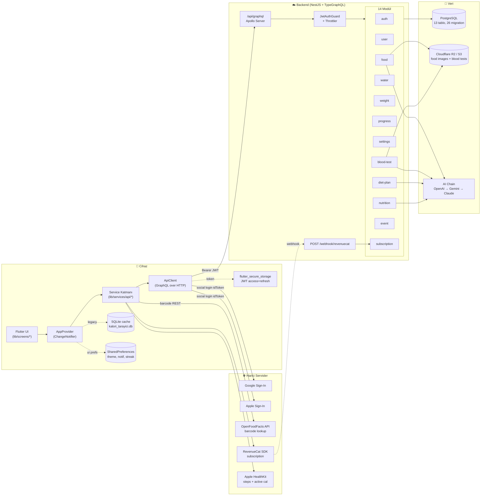
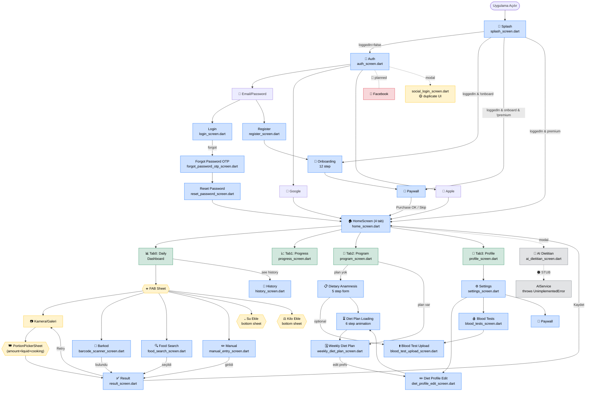
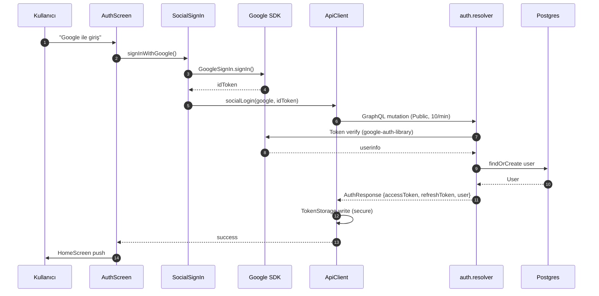
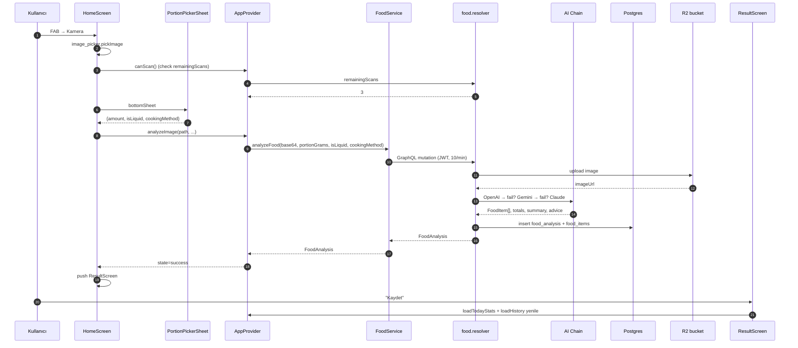
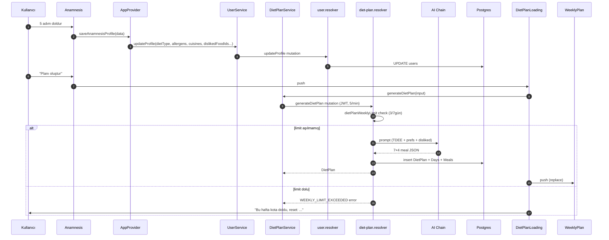
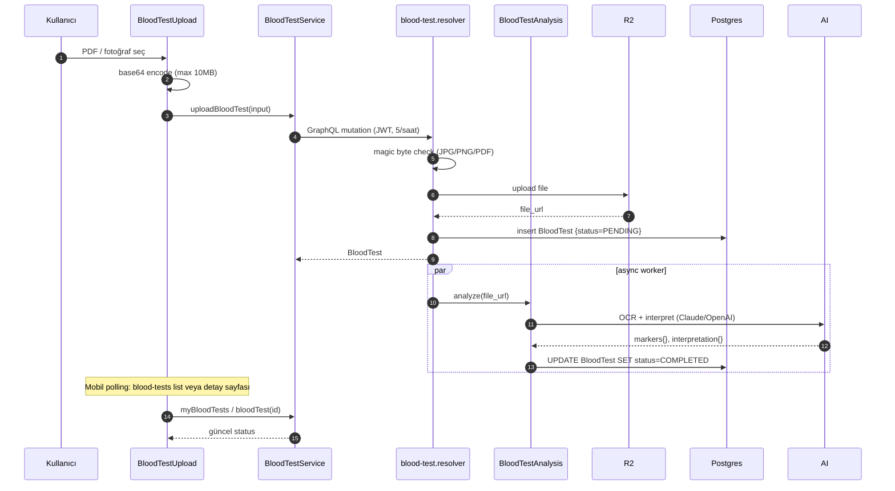
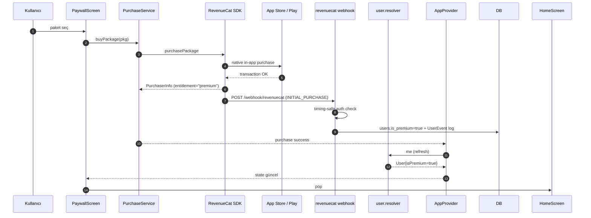

# Eatiq — Tam Uygulama Şeması (Mobil × Backend Blueprint)

> **Amaç:** Uygulamadaki tüm ekranları, alt akışları, backend endpoint'lerini ve bağlantı durumlarını tek dosyada görmek. **Son pull:** `eatiq_backend@e6ce8c0` (main, 2026-04-23). Mobil: Flutter 3.41.

---

## 🚀 Implementation Status — 2026-04-24 Session

**Jira:** 12 yeni task açıldı ([EAT-133 → EAT-144](https://baseflowtech.atlassian.net/projects/EAT/issues)) — mobile task'ları Fatih'e, backend-only (EAT-140) Kürşat'a atandı.

**Bu oturumda mobile-side tamamlandı (dart analyze: 0 error):**

| Task | Ne yapıldı | Dokunulan dosya |
|------|------------|-----------------|
| ✅ [EAT-137](https://baseflowtech.atlassian.net/browse/EAT-137) | Duplicate `social_login_screen.dart` silindi | `lib/screens/social_login_screen.dart` (removed) |
| ✅ [EAT-133](https://baseflowtech.atlassian.net/browse/EAT-133) | `timezoneOffsetMinutes` tüm 4 progress query'sine eklendi | `progress_service.dart` |
| ✅ [EAT-118](https://baseflowtech.atlassian.net/browse/EAT-118) wire | `updateMeal` mutation gerçek mutation'a bağlandı (stub kaldırıldı) | `food_service.dart`, `app_provider.dart:309+` |
| ✅ [EAT-96](https://baseflowtech.atlassian.net/browse/EAT-96) wire | `deleteAccount` Settings'e eklendi (GDPR, confirm dialog + loader) | `user_service.dart`, `app_provider.dart`, `settings_screen.dart` |
| ✅ [EAT-134](https://baseflowtech.atlassian.net/browse/EAT-134) | `WEEKLY_LIMIT_EXCEEDED` dedicated dialog + `dietPlanWeeklyLimit` badge | `diet_plan_service.dart`, `diet_plan_loading_screen.dart`, `program_screen.dart` |
| ✅ [EAT-135](https://baseflowtech.atlassian.net/browse/EAT-135) | Anamnez'e "sevmediğin yiyecekler" adımı + `dislikedFoodIds` → `generateDietPlan` | `dietary_anamnesis_screen.dart`, `app_provider.dart`, `diet_plan_service.dart`, `user_service.dart` |
| ✅ [EAT-136](https://baseflowtech.atlassian.net/browse/EAT-136) | Food Search'e 10 dietary tag chip filtresi (vegan/gluten_free/keto/…) client-side filter | `food_search_screen.dart`, `nutrition_service.dart` |
| ✅ [EAT-138](https://baseflowtech.atlassian.net/browse/EAT-138) | Weekly Diet Plan'da meal "Swap" aksiyonu → `recommendMeal` → session-only replace | `weekly_diet_plan_screen.dart`, `nutrition_service.dart` |

**Shipped-but-deferred / bloklanmış:**

| Task | Durum | Açıklama |
|------|-------|----------|
| 🟡 [EAT-117](https://baseflowtech.atlassian.net/browse/EAT-117) follow-up | Ertelendi | Onboarding'teki hardcoded diyet listesinin BE `dietaryPreferenceOptions` ile değiştirilmesi. Service method'u hazır (`NutritionService.dietaryPreferenceOptions()`), onboarding ekranı büyük refactor gerektiriyor — bir sonraki iterasyona. |
| 🔴 [EAT-139](https://baseflowtech.atlassian.net/browse/EAT-139) | Ertelendi | Legacy SQLite cache kaldırma — EAT-141'den sonra (offline queue karar verilmeli). |
| 🔴 [EAT-140](https://baseflowtech.atlassian.net/browse/EAT-140) | Kürşat | `food.generateMealPlan` dead-code cleanup (backend). |
| 🔴 [EAT-141](https://baseflowtech.atlassian.net/browse/EAT-141) | Ertelendi | Offline mutation queue (3-5 gün iş). |
| 🔴 [EAT-142](https://baseflowtech.atlassian.net/browse/EAT-142) | Bloke | Apple Health → BE sync (BE endpoint yok, backend read-only kuralı). |
| 🔴 [EAT-143](https://baseflowtech.atlassian.net/browse/EAT-143) | Bloke | AI Dietitian chat mobile — [EAT-114](https://baseflowtech.atlassian.net/browse/EAT-114) (BE) IDEA. |
| 🔴 [EAT-144](https://baseflowtech.atlassian.net/browse/EAT-144) | Bloke | Push notifications mobile — [EAT-115](https://baseflowtech.atlassian.net/browse/EAT-115) (BE) IDEA. |

**Mobile service katmanına eklenen metodlar:**
- `UserService.deleteAccount()` + `updateProfile(..., dislikedFoodIds)`
- `FoodService.updateMeal(...)`
- `DietPlanService.generatePlan(dislikedFoodIds)` + `weeklyLimit()` + `DietPlanWeeklyLimit` model
- `NutritionService.recommendMeal(category)` + `dietaryPreferenceOptions()` + `foodsCount()` + `foods(dietTagFilter)` + `RecommendedMeal`/`RecommendedFoodItem`/`DietaryPreferenceOption` modelleri
- `ProgressService.*` tüm query'ler `timezoneOffsetMinutes` otomatik geçiriyor

**Ekran değişiklikleri:**
- `settings_screen.dart` → "Hesap" section'ı (Delete Account) + confirm dialog + loader
- `diet_plan_loading_screen.dart` → `WEEKLY_LIMIT_EXCEEDED` dedicated dialog (resetAt'ı locale'e göre format)
- `program_screen.dart` → "X/3 plan kaldı bu hafta" badge (kırmızı blocked state)
- `dietary_anamnesis_screen.dart` → 5 adım → **6 adım**; yeni "Sevmediğin yiyecekler" search + multi-select chip
- `food_search_screen.dart` → 10-chip dietary tag row + client-side filter
- `weekly_diet_plan_screen.dart` → meal detail sheet'e "Swap" butonu + alternative bottom sheet

**Lokalizasyon:** Tr/En inline string'lerle eklendi (tek dilli production için `.arb` migration'ı follow-up olarak bırakıldı).

**Geriye kalan gap'ler** (blueprint Section ⑧ — Eksik Entegrasyonlar) BE tarafı Kürşat'ta: dietitian chat endpoint (EAT-114), push notifications service (EAT-115), Apple Health ingest, Facebook provider UI (EAT-116 mevcut).

---
>
> **Nasıl okunur:** Mermaid diyagramları GitHub, VS Code (Markdown Preview Mermaid Support eklentisi), Obsidian ve HackMD'de otomatik render olur. Aşağı doğru sırayla okuyun:
> `① Mimari → ② Tam navigation akışı → ③ Ekran envanteri → ④ Backend endpoint envanteri → ⑤ Ekran↔Endpoint matrisi → ⑥ Sequence akışları → ⑦ ERD → ⑧ Eksik entegrasyonlar → ⑨ Pull yenilikleri`
>
> **Efsane:**
> - 🟢 **CONNECTED** — backend entegrasyonu tamam
> - 🟡 **LOCAL-ONLY** — sadece cihaz/lokal çalışıyor, backend bekleniyor değil
> - 🔴 **PLANNED** — mobil/UI var ama backend bağlantısı yok (gelecekte bağlanacak)
> - ⚫ **STUB** — placeholder kod, gerçek implementasyon yok

---

## ① Üst Seviye Sistem Mimarisi



---

## ② Tam Navigation Akışı — 27 Ekran Tek Diyagramda

> Node renkleri: **mavi** = ana flow, **yeşil** = tab, **turuncu** = modal/sheet, **kırmızı** = eksik entegrasyon.



**Okunuş:** Splash 4 farklı yola çatallanır (login, onboarding, paywall, home). Home 4 tab; her FAB çağrısı 6 farklı giriş yolunu tetikler (kamera, galeri, barkod, arama, manuel, su/kilo). Program tab'ı Anamnesis → Loading → WeeklyPlan üçlüsüne yönlendirir. AI Dietitian şu an **stub** (UnimplementedError).

---

## ③ Ekran Envanteri (27 ekran)

> Her satır: ekran adı — dosya:satır — özet — parent/children — kullandığı servis(ler).

### A) Auth & Onboarding (7 ekran)

| # | Ekran | Dosya:Satır | Görev | Kullandığı Servis |
|---|-------|-------------|-------|-------------------|
| 1 | **Splash** | [lib/screens/splash_screen.dart:16](lib/screens/splash_screen.dart) | Bootstrap + ilk yönlendirme | `AppProvider.bootstrapSession()` |
| 2 | **Auth** | [lib/screens/auth/auth_screen.dart:14](lib/screens/auth/auth_screen.dart) | Sosyal/email seçim hub'ı | `AuthService`, `SocialSignIn` |
| 3 | **Login** | [lib/screens/auth/login_screen.dart:9](lib/screens/auth/login_screen.dart) | Email + parola login | `AuthService.login` |
| 4 | **Register** | [lib/screens/auth/register_screen.dart:8](lib/screens/auth/register_screen.dart) | Email + parola kayıt | `AuthService.signup` |
| 5 | **Forgot Password (OTP)** | [lib/screens/auth/forgot_password_otp_screen.dart:9](lib/screens/auth/forgot_password_otp_screen.dart) | OTP iste + doğrula | `AuthService.forgotPassword`, `verifyOtp` |
| 6 | **Reset Password** | [lib/screens/auth/reset_password_screen.dart:7](lib/screens/auth/reset_password_screen.dart) | Yeni parola belirle | `AuthService.resetPassword` |
| 7 | **Onboarding** | [lib/screens/onboarding_screen.dart:11](lib/screens/onboarding_screen.dart) | 12 adım profil formu (ad, cinsiyet, doğum, boy, kilo, hedef, tempo, aktivite, diyet tipi, özet) | `UserService.updateProfile` |
| 7b | **Social Login (legacy modal)** | [lib/screens/social_login_screen.dart:9](lib/screens/social_login_screen.dart) | 🟡 Eski duplicate UI — Auth Screen'in yanında kalmış | `SocialSignIn` |

### B) Ana Dashboard & Meal Entry (6 ekran + 4 modal)

| # | Ekran | Dosya:Satır | Görev | Kullandığı Servis |
|---|-------|-------------|-------|-------------------|
| 8 | **Home** | [lib/screens/home_screen.dart:22](lib/screens/home_screen.dart) | Günlük dashboard, 4-tab bottom nav | `AppProvider.loadTodayStats/History`, `HealthService`, `WidgetService` |
| 9 | **Barcode Scanner** | [lib/screens/barcode_scanner_screen.dart:10](lib/screens/barcode_scanner_screen.dart) | Kamera + barkod okur | `FoodService.lookupBarcode`, `FoodApiService` (OpenFoodFacts fallback) |
| 10 | **Food Search** | [lib/screens/food_search_screen.dart:54](lib/screens/food_search_screen.dart) | BE yemek DB araması + kategori filtresi + porsiyon sheet | `NutritionService.foods`, `foodCategories` |
| 11 | **Manual Entry** | [lib/screens/manual_entry_screen.dart:9](lib/screens/manual_entry_screen.dart) | Kullanıcı elle makro girer | `FoodService.saveFoodAnalysis` |
| 12 | **Result** | [lib/screens/result_screen.dart:10](lib/screens/result_screen.dart) | AI/barcode/search sonucunu onaylat + kaydet | `FoodService.saveFoodAnalysis`, `toggleFavoriteMeal` |
| 13 | **History** | [lib/screens/history_screen.dart:11](lib/screens/history_screen.dart) | Tarihsel yemek log (tarih + takvim) | `FoodService.foodHistory`, `getDailyMeals` |
| M1 | FAB Sheet (kamera/galeri/barkod/arama/su/kilo) | home_screen `_showScanSheet()` | Merkezi giriş menüsü | — |
| M2 | PortionPickerSheet | [lib/widgets/portion_picker_sheet.dart](lib/widgets/portion_picker_sheet.dart) | Porsiyon + liquid + pişirme | — |
| M3 | Su Ekle Sheet | home_screen `_showAddWater()` | 250/500/700 ml + reset | `WaterService.logWater/resetWater` |
| M4 | Kilo Ekle Sheet | home_screen `_showAddWeight()` | Ağırlık logla | `WeightService.logWeight` |

### C) Progress & Program (5 ekran)

| # | Ekran | Dosya:Satır | Görev | Kullandığı Servis |
|---|-------|-------------|-------|-------------------|
| 14 | **Progress** | [lib/screens/progress_screen.dart:10](lib/screens/progress_screen.dart) | Today/Week/30D/Weight grafikler | `ProgressService.todayStats/weeklyStats/monthlyStats`, `WeightService.weightLogs` |
| 15 | **Program** | [lib/screens/program_screen.dart:9](lib/screens/program_screen.dart) | Aktif plan varsa göster, yoksa anamnez tetikle | `DietPlanService.myDietPlan` |
| 16 | **Dietary Anamnesis** | [lib/screens/dietary_anamnesis_screen.dart:41](lib/screens/dietary_anamnesis_screen.dart) | 5 adım: kısıtlamalar, cuisine, öğün sayısı, pişirme, bütçe | `UserService.updateProfile` (diet prefs) |
| 17 | **Diet Plan Loading** | [lib/screens/diet_plan_loading_screen.dart:11](lib/screens/diet_plan_loading_screen.dart) | 6 adım Lottie animasyonu + AI çağrısı | `DietPlanService.generateDietPlan` |
| 18 | **Weekly Diet Plan** | [lib/screens/weekly_diet_plan_screen.dart:47](lib/screens/weekly_diet_plan_screen.dart) | 7 gün × 4 öğün, completeMeal | `DietPlanService.regenerateDay`, `completeMeal` |

### D) Profile / Settings / Blood Test (5 ekran)

| # | Ekran | Dosya:Satır | Görev | Kullandığı Servis |
|---|-------|-------------|-------|-------------------|
| 19 | **Profile** | [lib/screens/profile_screen.dart:10](lib/screens/profile_screen.dart) | Kullanıcı özeti, streak, kilo, settings ikonu | `UserService.me`, `WeightService` |
| 20 | **Settings** | [lib/screens/settings_screen.dart:11](lib/screens/settings_screen.dart) | Dil/tema/bildirim/hedef | `SettingsService.appSettings/updateAppSettings`, `UserService.updateProfile`, `NotificationService` |
| 21 | **Diet Profile Edit** | [lib/screens/diet_profile_edit_screen.dart:45](lib/screens/diet_profile_edit_screen.dart) | Anamnez formunun düzenlenebilir versiyonu + regenerate | `UserService.updateProfile`, `DietPlanService.generateDietPlan` |
| 22 | **Blood Tests** | [lib/screens/blood_tests_screen.dart:15](lib/screens/blood_tests_screen.dart) | Yüklenmiş kan testleri listesi | `BloodTestService.myBloodTests`, `deleteBloodTest` |
| 23 | **Blood Test Upload** | [lib/screens/blood_test_upload_screen.dart:20](lib/screens/blood_test_upload_screen.dart) | PDF/image base64 upload | `BloodTestService.uploadBloodTest` |

### E) Premium & AI (2 ekran)

| # | Ekran | Dosya:Satır | Görev | Kullandığı Servis |
|---|-------|-------------|-------|-------------------|
| 24 | **Paywall** | [lib/screens/paywall_screen.dart:11](lib/screens/paywall_screen.dart) | RevenueCat paketleri + purchase | `PurchaseService` (RevenueCat SDK) + `AppProvider.refreshPremiumStatus` (BE `me.isPremium`) |
| 25 | **AI Dietitian** ⚫ | [lib/screens/ai_dietitian_screen.dart:32](lib/screens/ai_dietitian_screen.dart) | Chat UI — mock/stub | `AIService.analyzeFood()` → `UnimplementedError` |

### F) Reserved / yarım (varsa)

> Mevcut `lib/screens/` listesinde başka dosya yok. `social_login_screen.dart` (#7b) gereksiz duplicate, silinmeye aday.

---

## ④ Backend Endpoint Envanteri — 14 modül / 48 GraphQL + 1 REST

> Hepsi code-first TypeGraphQL. `Public` işaretli olanlar dışında hepsi JWT gerektirir. Throttle limiti parantez içinde.

### auth/ — 9 endpoint

| Tip | İsim | Input | Return | Auth | Throttle | Kaynak |
|-----|------|-------|--------|------|----------|--------|
| Q | authHealth | — | String | Public | default | auth.resolver.ts:20 |
| M | socialLogin | SocialLoginInput (provider, idToken) | AuthResponse | Public | 10/min | auth.resolver.ts:27 |
| M | signup | SignupInput | AuthResponse | Public | 5/min | auth.resolver.ts:35 |
| M | login | LoginInput | AuthResponse | Public | 5/min | auth.resolver.ts:42 |
| M | forgotPassword | ForgotPasswordInput | ForgotPasswordResponse | Public | 3/min | auth.resolver.ts:49 |
| M | verifyOtp | VerifyOtpInput | Boolean | Public | 5/min | auth.resolver.ts:56 |
| M | resetPassword | ResetPasswordInput | Boolean | Public | 5/min | auth.resolver.ts:63 |
| M | refreshToken | refreshToken String! | AuthResponse | Public | 10/min | auth.resolver.ts:70 |
| M | logout | — | Boolean | JWT | default | auth.resolver.ts:75 |

### user/ — 4 endpoint

| Tip | İsim | Input | Return | Auth | Throttle | Kaynak |
|-----|------|-------|--------|------|----------|--------|
| Q | userHealth | — | String | Public | default | user.resolver.ts:13 |
| Q | me | — | User | JWT | 30/min | user.resolver.ts:19 |
| M | updateProfile | UpdateProfileInput | User | JWT | 10/min | user.resolver.ts:29 |
| M | deleteAccount | — | Boolean | JWT | 3/hour | user.resolver.ts:38 |

### food/ — 9 endpoint

| Tip | İsim | Input | Return | Auth | Throttle | Kaynak |
|-----|------|-------|--------|------|----------|--------|
| Q | lookupBarcode | barcode String! | BarcodeResult? | JWT | 20/min | food.resolver.ts:23 |
| M | analyzeFood | AnalyzeFoodInput (image base64, portionGrams, isLiquid, cookingMethod) | FoodAnalysis | JWT | 10/min | food.resolver.ts:33 |
| Q | foodHistory | limit, offset | [FoodAnalysis] | JWT | 60/min | food.resolver.ts:42 |
| Q | getDailyMeals | date "YYYY-MM-DD" | [FoodAnalysis] | JWT | 60/min | food.resolver.ts:55 |
| M | toggleFavoriteMeal | mealId, isFavorite | FoodAnalysis | JWT | 30/min | food.resolver.ts:70 |
| M | deleteMeal | mealId | Boolean | JWT | 30/min | food.resolver.ts:83 |
| M | saveFoodAnalysis | ManualFoodInput | FoodAnalysis | JWT | 20/min | food.resolver.ts:92 |
| M | updateMeal | mealId, ManualFoodInput | FoodAnalysis | JWT | 30/min | food.resolver.ts:104 |
| M | generateMealPlan | planType daily/weekly | String(JSON) | JWT | 5/min | food.resolver.ts:114 |

### water/ — 3 endpoint

| Tip | İsim | Input | Return | Auth | Throttle | Kaynak |
|-----|------|-------|--------|------|----------|--------|
| M | logWater | liters Float!, date? | WaterLog | JWT | 30/min | water.resolver.ts:13 |
| M | resetWater | date? | WaterLog | JWT | 30/min | water.resolver.ts:23 |
| Q | waterLogs | limit, offset | [WaterLog] | JWT | 60/min | water.resolver.ts:32 |

### weight/ — 2 endpoint

| Tip | İsim | Input | Return | Auth | Throttle | Kaynak |
|-----|------|-------|--------|------|----------|--------|
| M | logWeight | weight Float!, date? | WeightLog | JWT | 30/min | weight.resolver.ts:13 |
| Q | weightLogs | limit, offset | [WeightLog] | JWT | 60/min | weight.resolver.ts:23 |

### progress/ — 4 endpoint (**timezone-aware**, son commit)

| Tip | İsim | Input | Return | Auth | Throttle | Kaynak |
|-----|------|-------|--------|------|----------|--------|
| Q | todayStats | timezoneOffsetMinutes? | TodayStats | JWT | 60/min | progress.resolver.ts:18 |
| Q | weeklyStats | timezoneOffsetMinutes? | PeriodStats | JWT | 60/min | progress.resolver.ts:32 |
| Q | monthlyStats | timezoneOffsetMinutes? | PeriodStats | JWT | 60/min | progress.resolver.ts:48 |
| Q | remainingScans | timezoneOffsetMinutes? | Int | JWT | 60/min | progress.resolver.ts:64 |

### settings/ — 2 endpoint

| Tip | İsim | Input | Return | Auth | Throttle | Kaynak |
|-----|------|-------|--------|------|----------|--------|
| Q | appSettings | — | UserSettings | JWT | 30/min | settings.resolver.ts:14 |
| M | updateAppSettings | UpdateAppSettingsInput | UserSettings | JWT | 20/min | settings.resolver.ts:20 |

### nutrition/ — 6 endpoint

| Tip | İsim | Input | Return | Auth | Throttle | Kaynak |
|-----|------|-------|--------|------|----------|--------|
| Q | foods | limit, offset, FoodsFilterInput? | [Food] | JWT | 60/min | nutrition.resolver.ts:24 |
| Q | food | id | Food | JWT | 60/min | nutrition.resolver.ts:44 |
| Q | foodCategories | — | [String] | Public | 60/min | nutrition.resolver.ts:53 |
| Q | foodsCount | FoodsFilterInput? | Int | Public | 60/min | nutrition.resolver.ts:59 |
| Q | dietaryPreferenceOptions | — | [DietaryPreferenceOption] | Public | 60/min | nutrition.resolver.ts:72 |
| Q | recommendMeal | MealCategory! | RecommendedMeal | JWT | 20/min | nutrition.resolver.ts:82 |

### diet-plan/ — 5 endpoint (**weekly limit**: 3/7gün)

| Tip | İsim | Input | Return | Auth | Throttle | Kaynak |
|-----|------|-------|--------|------|----------|--------|
| M | generateDietPlan | GenerateDietPlanInput? (dislikedFoodIds vb.) | DietPlan | JWT | 5/min | diet-plan.resolver.ts:20 |
| Q | myDietPlan | — | DietPlan? | JWT | 60/min | diet-plan.resolver.ts:30 |
| Q | dietPlanWeeklyLimit | — | DietPlanWeeklyLimit {limit, used, remaining, resetAt} | JWT | 60/min | diet-plan.resolver.ts:36 |
| M | regenerateDay | RegenerateDayInput | DietPlan | JWT | 10/min | diet-plan.resolver.ts:42 |
| M | completeMeal | mealId | DietPlanMeal | JWT | 60/min | diet-plan.resolver.ts:51 |

### blood-test/ — 4 endpoint

| Tip | İsim | Input | Return | Auth | Throttle | Kaynak |
|-----|------|-------|--------|------|----------|--------|
| M | uploadBloodTest | UploadBloodTestInput (base64 JPG/PNG/PDF) | BloodTest | JWT | 5/hour | blood-test.resolver.ts:17 |
| Q | myBloodTests | limit, offset | [BloodTest] | JWT | 60/min | blood-test.resolver.ts:26 |
| Q | bloodTest | id | BloodTest | JWT | 60/min | blood-test.resolver.ts:36 |
| M | deleteBloodTest | id | Boolean | JWT | 10/min | blood-test.resolver.ts:45 |

### event/ — iç analytics
Resolver yok; servisler `UserEvent` tablosuna fire-and-forget log atar (BARCODE_LOOKUP, FOOD_SEARCHED, PREMIUM_ACTIVATED, FOOD_UPDATED...).

### subscription/ — 1 REST
| POST /webhook/revenuecat | Public + timing-safe auth header | RevenueCat olayları (INITIAL_PURCHASE, RENEWAL, CANCELLATION...) → `user.is_premium` güncelle | subscription.controller.ts:16 |

### common/ & config/ — yardımcı
- `StorageService` (S3/R2 upload: food images + blood tests)
- `EmailService` (OTP/reset emailleri)
- `JwtAuthGuard`, `GqlThrottlerGuard`, `LoggingInterceptor`, `GraphqlExceptionFilter`
- 10 MB body limit (base64 foto/pdf)

**Toplam: 48 GraphQL operation + 1 REST webhook.**

---

## ⑤ Ekran ↔ Endpoint Eşleme Matrisi (ANA TABLO)

> Bu tablo dokümanın en kritik kısmı. Her ekran için: hangi endpoint(ler) çağrılıyor + durum.

| Ekran / Akış | Çağrılan Backend Endpoint(leri) | Durum | Not |
|--------------|---------------------------------|-------|-----|
| **Splash** | `me` (bootstrap) | 🟢 | AppProvider.loadAuthStatus + refreshPremiumStatus |
| **Auth (hub)** | — | 🟢 | UI only, servis login ekranlarında |
| **Login** | `login` | 🟢 | Email+password, 5/min throttle |
| **Register** | `signup` | 🟢 | Email+password |
| **Forgot Password OTP** | `forgotPassword`, `verifyOtp` | 🟢 | Email OTP, 3-5/min throttle |
| **Reset Password** | `resetPassword` | 🟢 | OTP sonrası yeni parola |
| **Social Login (Google)** | `socialLogin(provider=google)` | 🟢 | google_sign_in → idToken |
| **Social Login (Apple)** | `socialLogin(provider=apple)` | 🟢 | sign_in_with_apple → identityToken |
| **Social Login (Facebook)** | `socialLogin(provider=facebook)` | 🔴 **PLANNED** | Backend hazır, mobilde SDK entegrasyonu yok |
| **Onboarding (12 step)** | `updateProfile` | 🟢 | Step sonunda tüm profile push |
| **Home — Dashboard** | `todayStats`, `getDailyMeals`, `appSettings` | 🟢 | initState sonrası 3 parallel load |
| **Home — FAB Kamera** | `remainingScans`, `analyzeFood` | 🟢 | AI chain (OpenAI→Gemini→Claude) |
| **Home — FAB Galeri** | `analyzeFood` | 🟢 | Aynı analyzeFood mutation |
| **Home — FAB Barkod** | `lookupBarcode` (+ OpenFoodFacts REST fallback) | 🟢 | BE önce kendi cache'ini sorgular |
| **Home — FAB Arama** | `foods`, `foodCategories`, `saveFoodAnalysis` | 🟢 | USDA FDC entegreli foods tablosu |
| **Home — FAB Manuel** | `saveFoodAnalysis` | 🟢 | Manuel makro girişi |
| **Home — FAB Su Ekle** | `logWater`, `resetWater` | 🟢 | Günlük upsert |
| **Home — FAB Kilo Ekle** | `logWeight` | 🟢 | Günlük upsert |
| **PortionPickerSheet** | (analyzeFood input'una eklenir) | 🟢 | portionAmount, isLiquid, cookingMethod |
| **Result** | `saveFoodAnalysis`, `toggleFavoriteMeal`, `deleteMeal`, `updateMeal` | 🟢 | Onay + düzenleme + silme (sadece bugün) |
| **History** | `foodHistory`, `getDailyMeals` | 🟢 | Takvim + tarih filtresi |
| **Progress (Today/Week/Month)** | `todayStats`, `weeklyStats`, `monthlyStats` | 🟢 | timezoneOffsetMinutes param |
| **Progress (Weight tab)** | `weightLogs` | 🟢 | Grafiklerle birlikte |
| **Program (empty state)** | `myDietPlan` | 🟢 | null → Anamnesis CTA |
| **Program (active)** | `myDietPlan`, `dietPlanWeeklyLimit` | 🟢 | Aktif planı render + kalan kota |
| **Dietary Anamnesis** | `updateProfile` (diet prefs) + optional `uploadBloodTest` | 🟢 | 5 adım form sonunda updateProfile |
| **Diet Plan Loading** | `generateDietPlan` | 🟢 | dislikedFoodIds dahil |
| **Weekly Diet Plan** | `regenerateDay`, `completeMeal` | 🟢 | Gün bazlı regen + öğün tamamlama |
| **Profile** | `me`, `weightLogs` | 🟢 | Kullanıcı özeti + kilo |
| **Settings** | `appSettings`, `updateAppSettings`, `updateProfile` | 🟢 | Notif + tema + hedef + dil |
| **Diet Profile Edit** | `updateProfile`, `generateDietPlan` | 🟢 | Değişiklik → regenerate |
| **Blood Tests (list)** | `myBloodTests`, `deleteBloodTest` | 🟢 | List + long-press delete |
| **Blood Test Upload** | `uploadBloodTest` | 🟢 | Base64, max 10MB, JPG/PNG/PDF |
| **Paywall** | RevenueCat SDK → `POST /webhook/revenuecat` → `me.isPremium` | 🟢 | Client triggers, webhook validates |
| **AI Dietitian Chat** | **— (yok)** | ⚫ **STUB** | `AIService` UnimplementedError; BE'de chat endpoint yok |
| **Notifications (local)** | `updateAppSettings` (sync) | 🟡 | Reminder flutter_local_notifications; push kanalı yok |
| **Apple HealthKit** | — | 🟡 | Device only (steps, active cal) |
| **SQLite cache** | — | 🟡 | Legacy; aktif sync yok, silinmeye aday |
| **Home Widget (iOS)** | — | 🟡 | home_widget plugin, BE'ye dokunmuyor |
| **Apple Health meal logging** | — | 🟡 | HealthKit writeMeal (opsiyonel) |
| **Facebook Login UI button** | — | 🔴 | Auth ekranında görünmüyor bile |
| **Push notifications (FCM/APNs)** | — | 🔴 **PLANNED** | BE'den olay tetiklemeli bildirim yok |
| **Offline mutation queue** | — | 🔴 **PLANNED** | Network kesintisinde yazma kaybı riski |
| **AI Dietitian streaming chat** | — | 🔴 **PLANNED** | SSE/WebSocket yok, chat endpoint yok |
| **Kullanılmayan endpoint** `generateMealPlan` (food modülü, diet-plan yerine duplicate?) | — | ⚠️ | Mobile'da referansı yok; diet-plan.generateDietPlan kullanılıyor |

**Özet sayılar**
- 🟢 CONNECTED: 36 akış noktası
- 🟡 LOCAL-ONLY: 5 (notifications, HealthKit, SQLite, widget, health meal log)
- 🔴 PLANNED: 4 (Facebook, push, offline queue, dietitian chat)
- ⚫ STUB: 1 (AI Dietitian screen)
- ⚠️ Backend'de mobilde çağrılmayan endpoint: `food.generateMealPlan`, `nutrition.recommendMeal` (ikincisi Diet Plan Loading içinde kullanılabilir, teyit gerekiyor)

---

## ⑥ Kritik Akışlar — Sequence Diagramları

### 6.1 Social Login (Google)



### 6.2 Kameradan Öğün Ekleme



### 6.3 Barkod Akışı

```mermaid
sequenceDiagram
    autonumber
    participant U as Kullanıcı
    participant BS as BarcodeScanner
    participant FS as FoodService
    participant FAS as FoodApiService
    participant BE as food.resolver
    participant OFF as OpenFoodFacts
    U->>BS: Kamera → barkod okundu
    BS->>FS: lookupBarcode(code)
    FS->>BE: query lookupBarcode (JWT, 20/min)
    BE-->>FS: BarcodeResult? (BE cache hit/miss)
    alt BE cache hit
        FS-->>BS: ürün bilgisi
    else miss → fallback
        BS->>FAS: fetchByBarcode(code)
        FAS->>OFF: GET /api/v2/product/{code}
        OFF-->>FAS: product JSON
        FAS-->>BS: normalize
    end
    BS->>ResultScreen: push (değerlerle)
```

### 6.4 Diet Plan Üretimi



### 6.5 Blood Test Upload



### 6.6 Premium Satın Alma



---

## ⑦ ERD — Veritabanı

```mermaid
erDiagram
    users ||--o{ food_analyses : owns
    food_analyses ||--o{ food_items : contains
    users ||--o{ water_logs : logs
    users ||--o{ weight_logs : logs
    users ||--o{ daily_scan_counts : tracks
    users ||--o{ user_events : emits
    users ||--o{ diet_plans : has
    diet_plans ||--o{ diet_plan_days : has
    diet_plan_days ||--o{ diet_plan_meals : slots
    users ||--o{ blood_tests : uploads
    users ||--|| user_settings : has
    foods ||--o{ diet_plan_meals : referenced

    users {
        uuid id PK
        string email UK
        string provider "google|facebook|apple|email"
        string provider_id
        int age
        float height_cm
        float weight_kg
        string gender
        string goal "lose|maintain|gain"
        string activity_level
        float daily_calorie_goal
        float water_goal
        string unit_system
        string locale
        bool is_premium
        int streak
        string[] cuisine_preferences
        string[] allergens
        string[] disliked_food_ids
        string diet_type "standard|vegan|pescatarian..."
        date last_scan_date
    }
    food_analyses {
        uuid id PK
        uuid user_id FK
        string image_url
        text summary
        text advice
        timestamp analyzed_at
        string meal_category "breakfast|lunch|dinner|snack"
        bool is_favorite
        float total_calories
        float total_protein
        float total_carbs
        float total_fat
        float total_fiber
        float total_sugar
    }
    food_items {
        uuid id PK
        uuid analysis_id FK
        string name
        string name_tr
        float portion
        string portion_unit
        float calories
        float protein
        float carbs
        float fat
        float fiber
        float sugar
        string health_score
        string[] tags
    }
    foods {
        uuid id PK
        string name
        string name_tr
        string category
        float calories_per_100g
        float protein_g
        float carbs_g
        float fat_g
        float fiber_g
        float sugar_g
        string source "USDA_FDC|manual"
        int fdc_id
        string[] tags
    }
    water_logs {
        uuid id PK
        uuid user_id FK
        date date
        float liters
    }
    weight_logs {
        uuid id PK
        uuid user_id FK
        date date
        float weight
    }
    daily_scan_counts {
        uuid id PK
        uuid user_id FK
        date date
        int count
    }
    user_events {
        uuid id PK
        uuid user_id FK
        string event_type
        jsonb metadata
        timestamp created_at
    }
    diet_plans {
        uuid id PK
        uuid user_id FK
        string status "ACTIVE|COMPLETED|EXPIRED"
    }
    diet_plan_days {
        uuid id PK
        uuid plan_id FK
        int day_number "1-7"
    }
    diet_plan_meals {
        uuid id PK
        uuid day_id FK
        uuid food_id FK
        string meal_category
        float portion
        timestamp completed_at
    }
    blood_tests {
        uuid id PK
        uuid user_id FK
        date test_date
        string file_url
        string status "PENDING|COMPLETED|FAILED"
        jsonb markers
        jsonb interpretation
    }
    user_settings {
        uuid id PK
        uuid user_id FK UK
        bool notifications_enabled
        string theme "system|light|dark"
        string language
        json reminder_times
    }
```

---

## ⑧ Eksik Entegrasyonlar — Hangi Ekran Hangi Bağlantıyı Bekliyor?

> Bu bölüm "bu kısım şu entegrasyona bağlanacak" listesidir. Jira task **şu an açılmıyor** (Fatih sonra karar verecek). Her madde: mobil tarafı + backend tarafı + önerilen akış.

### 8.1 🔴 AI Dietitian Chat (AiDietitianScreen)
- **Mobil:** [lib/screens/ai_dietitian_screen.dart:32](lib/screens/ai_dietitian_screen.dart) UI mevcut; [lib/services/ai_service.dart](lib/services/ai_service.dart) stub
- **Backend:** endpoint YOK. Ne `dietitianChat`, ne SSE/WebSocket, ne streaming
- **Gerekli:** backend'de yeni modül `dietitian/` → `sendDietitianMessage(history, message)` mutation veya SSE subscription. Prompt context: kullanıcı profili + son 7 gün yediği + blood test markers (varsa)
- **Yerleşim önerisi:** şemada HOME → AID node'u dashed kırmızı → gelecekte BE/dietitian modülüne bağlanacak

### 8.2 🔴 Facebook Social Login (AuthScreen)
- **Mobil:** [lib/services/auth/social_sign_in.dart](lib/services/auth/social_sign_in.dart) sadece Google+Apple. Facebook butonu bile yok
- **Backend:** `socialLogin(provider=facebook, idToken)` zaten hazır (FacebookStrategy mevcut)
- **Gerekli:** `flutter_facebook_auth` paketi + AuthScreen'e buton + SocialSignIn.signInWithFacebook() metodu

### 8.3 🔴 Push Notifications (FCM / APNs)
- **Mobil:** `flutter_local_notifications` sadece lokal reminder yapıyor. `firebase_messaging` yok
- **Backend:** push gönderen servis yok
- **Gerekli:** (a) FCM + APNs kurulum, (b) backend'de `notifications/` modülü + device_tokens tablosu, (c) olay tetikleyicileri: diet plan hazır, blood test COMPLETED, streak kırılma uyarısı

### 8.4 🔴 Offline Mutation Queue
- **Mobil:** Network kesintisinde `analyzeFood`, `logWater`, `logWeight` kayıp
- **Gerekli:** Drift/Isar ile local queue + bağlantı geldiğinde replay. Idempotency key'leri bazı endpoint'lere eklenebilir (logWater/Weight zaten date-based upsert, güvenli)

### 8.5 🟡 SQLite cache temizliği (legacy)
- [lib/services/database_service.dart](lib/services/database_service.dart) hala `analyses`, `water_log`, `weight_log` tablolarını tutuyor. AppProvider artık backend üzerinden çalışıyor; bu dosya aktif kullanılıyor mu netleşmeli
- **Aksiyon:** çağrılarını grepleyip ya tamamen kaldır ya da "offline queue" için repurpose et

### 8.6 🟡 social_login_screen.dart duplicate
- [lib/screens/social_login_screen.dart](lib/screens/social_login_screen.dart) eski akıştan kalmış; AuthScreen (#2) ile fonksiyonel duplicate
- **Aksiyon:** sil veya merge

### 8.7 ⚠️ Kullanılmayan backend endpoint: `food.generateMealPlan`
- `src/food/food.resolver.ts:114` — mobilde çağrılmıyor. `diet-plan.generateDietPlan` kullanılıyor. Eski denemeden kalmış olabilir. Silinmeli mi?

### 8.8 ⚠️ `nutrition.recommendMeal` mobil kullanım
- Backend'de hazır, mobilde referansı yok. Diet Plan Loading veya Weekly Diet Plan içinde "öğün yerine öneri al" butonu olarak kullanılabilir

### 8.9 🔴 Apple Health → Backend sync
- [lib/services/health_service.dart](lib/services/health_service.dart) HealthKit'ten veri alıyor ama backend'e push edilmiyor. Steps + active cal, günlük stats hesabına girmeli mi? Ürün kararı

---

## ⑨ Pull Sonrası Yenilikler (son ~22 commit)

Son güncel commit'ler (eski BACKEND_ARCHITECTURE.md'de yok):
- **e6ce8c0** `EAT-131` — `todayStats/weeklyStats/monthlyStats/remainingScans` artık `timezoneOffsetMinutes` alıyor → TR kullanıcısı için "bugün" doğru (mobil tarafta geçirilmeli, test: Progress ekranı gece yarısı civarında doğru gün mü gösteriyor)
- **8736bfe** `EAT-132` — `generateDietPlan(input: {dislikedFoodIds: [id]})` → Anamnesis formunda yeni multi-select chip gerekiyor
- **250648b** `EAT-130` — `updateMeal` fiber/sugar reset + food_items replace → Result edit modunda bu sonuçları UI'a yansıtmak
- **8f52309** `EAT-129` — `users.cuisine_preferences/allergens/disliked_food_ids` artık NOT NULL `[]` default → mobil tarafta nullable handling temizlenebilir
- **5ea0013** `EAT-128` — `dietPlanWeeklyLimit` eklendi (3/7gün) + `WEEKLY_LIMIT_EXCEEDED` exception → Diet Plan Loading hata state'i handle etmeli
- **83227e3** `EAT-125` — `saveFoodAnalysis` manuel isim prefix kaldırıldı + foods array doluyor → Manual Entry sonuçlarında food_items listesi gerçek
- **9bce0ec / 516f46e** — foods dietary tagging (vegan/vegetarian/gluten-free vb.) → Food Search ekranında filter chip olarak kullanılabilir
- **cd73bcd / ef09c38** — `food_analyses` artık `portion_amount`, `is_liquid`, `cooking_method` persist ediyor → Result ekranında tekrar edit ederken doğru önceki değerler gelir
- **d5c04d0** `EAT-SEC-1` — CORS + bcrypt + GraphQL introspection prod'da kapalı (güvenlik)
- **de86c6f** — 10MB JSON/URL-encoded body → büyük base64 fotoğraflar ve PDF'ler geçer

**Mobil tarafa yansıması gereken kısa TODO:**
- [ ] `timezoneOffsetMinutes: DateTime.now().timeZoneOffset.inMinutes` tüm progress query'lerine eklensin
- [ ] Diet Plan Loading, `WEEKLY_LIMIT_EXCEEDED` error'ı yakalayıp "bu hafta dolu, X tarihinde yenilenecek" göstersin
- [ ] Anamnesis'e "sevmediğim yemekler" multi-select chip'i → `dislikedFoodIds` olarak `generateDietPlan`'a
- [ ] Food Search filter chip'lerine backend'den gelen dietary tag'ler

---

## ⑩ Referanslar

**Mobil kritik dosyalar**
- [lib/main.dart](lib/main.dart) — bootstrap, 10 dil, navigatorKey
- [lib/services/app_provider.dart](lib/services/app_provider.dart) — ~1177 satır merkezi state
- [lib/services/api/api_client.dart](lib/services/api/api_client.dart) — GraphQL client, 401 retry, logout guard
- [lib/services/api/token_storage.dart](lib/services/api/token_storage.dart) — secure storage wrapper
- [pubspec.yaml](pubspec.yaml) — provider 6, http 1.2, flutter_secure_storage 9, purchases_flutter 8, health 12

**Backend kritik dosyalar**
- [eatiq_backend/src/app.module.ts](eatiq_backend/src/app.module.ts) — 14 modül registrasyonu
- [eatiq_backend/src/main.ts](eatiq_backend/src/main.ts) — helmet, CORS, 10MB body
- [eatiq_backend/src/common/guards/](eatiq_backend/src/common/guards/) — JwtAuthGuard
- [eatiq_backend/src/common/filters/](eatiq_backend/src/common/filters/) — GraphQL exception mapping
- [eatiq_backend/src/migrations/](eatiq_backend/src/migrations/) — 26 migration

**Mevcut dokümanlar (karşılaştırma için)**
- [APP_FLOW_ANALYSIS.md](APP_FLOW_ANALYSIS.md) — eski mobil akış dokümanı (bu dosya güncel tuttu)
- [eatiq_backend/BACKEND_ARCHITECTURE.md](eatiq_backend/BACKEND_ARCHITECTURE.md) — eski backend dokümanı (~49 commit geride, diet-plan/blood-test/event/nutrition/settings yok)
- [figma_screens_full.svg](figma_screens_full.svg) — 11 ekranın el yapımı wireframe'i (Nisan 9, Home/Splash/Onboarding vb. için placeholder mockup)
- [implementation_plan.md](implementation_plan.md) — proje roadmap (auth flow tasarımı)

---

## Sonuç: Tek Bakışta Skor

| Kategori | Durum |
|----------|-------|
| Auth akışı (email + Google + Apple) | 🟢 Tam |
| Auth Facebook | 🔴 Planned |
| Profil + onboarding | 🟢 Tam |
| Kameradan AI analiz | 🟢 Tam |
| Barkod + manuel + arama | 🟢 Tam |
| History / Progress | 🟢 Tam |
| Water + Weight | 🟢 Tam |
| Diet Plan (anamnez + haftalık + limit) | 🟢 Tam |
| Blood Test upload + AI interpret | 🟢 Tam |
| Premium / paywall (RevenueCat + webhook) | 🟢 Tam |
| Timezone-aware stats | 🟢 Tam (mobil tarafta param geçişi teyit gerekli) |
| Notification — local reminder | 🟡 Local |
| Notification — backend-triggered push | 🔴 Planned |
| AI Dietitian chat | ⚫ Stub (en büyük boşluk) |
| Offline queue | 🔴 Planned |
| Apple Health entegrasyonu | 🟡 Device-only, BE'ye yazılmıyor |

**En büyük gap:** AI Dietitian chat (hem UI stub hem backend endpoint yok). İkinci: push notifications. Geri kalan her şey production-ready.
