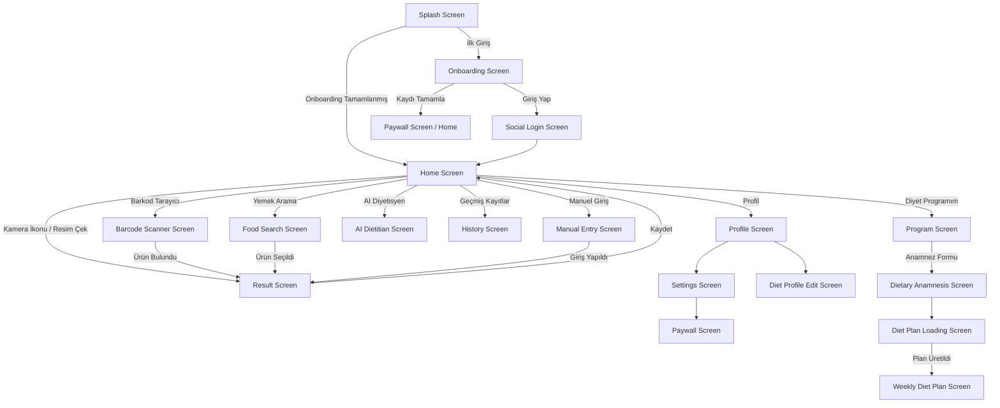

# AI Kalori Tarayıcı - Uygulama Akış Diyagramı ve Sayfa Analizi

Bu doküman, uygulamanızın sayfa bazında akışını, her bir sayfada hangi işlemlerin yapıldığını ve hangi temel fonksiyonların çalıştığını özetlemektedir.

## 📱 Uygulama Akış Diyagramı (Flow Diagram)

Aşağıdaki diyagramda sayfalar arası geçiş senaryoları özetlenmiştir:

---

## 📄 Sayfa Bazında Fonksiyonlar ve İşlevler

### 1. Splash Screen (`splash_screen.dart`)
**İşlevi:** Uygulamanın başlangıç ekranıdır.
**Temel Fonksiyonlar:**
- `_checkOnboarding()`: Kullanıcının uygulamayı ilk defa açıp açmadığını (`Provider` üzerinden) kontrol eder.
- Karara göre `HomeScreen`'e doğrudan geçiş yapar veya kullanıcıyı `OnboardingScreen`'e yönlendirir.

### 2. Onboarding Screen (`onboarding_screen.dart`)
**İşlevi:** Kullanıcıyı karşılar, temel bilgilerini (kilo, boy, hedef kilo vb.) alır ve uygulamanın mantığını anlatır.
**Temel Fonksiyonlar:**
- Hedef kalori ihtiyacını hesaplama formülleri tetiklenir (Harris-Benedict vb.).
- Kullanıcı verileri yerel depolama/veritabanına kaydedilir.

### 3. Social Login Screen (`social_login_screen.dart`)
**İşlevi:** Kullanıcı giriş ve doğrulama(Auth) işlemlerini yönetir.
**Temel Fonksiyonlar:**
- Apple, Google (ve varsa misafir) giriş yöntemleri sunulur.
- Firebase Auth veya Supabase gibi entegrasyonlarla kullanıcı oturumları yürütülür.
- Oturum oluşturulduktan sonra `HomeScreen`'e geçilir.

### 4. Home Screen (`home_screen.dart`)
**İşlevi:** Uygulamanın ana kumanda merkezidir. Günlük istatistiklerin görüldüğü, yeni öğün ekleme araçlarına ulaşılan gösterge panelidir (Dashboard).
**Temel Fonksiyonlar:**
- `loadTodayStats()`: Günlük tüketilen kaloriyi, kalan kaloriyi ve makroları(Protein, Karbonhidrat, Yağ) `Provider` veya lokal DB üzerinden getirir.
- **Butonlar ve Yönlendirmeler:** Kameredan fotoğraf seçimi (Image Picker), Manuel Ekleme, Barkod, Metin ile Arama modüllerine yönlendiren aksiyonlar içerir.
- Son eklenen besin listesini (`History`) küçük bir özetle sunar.

### 5. Barcode Scanner Screen (`barcode_scanner_screen.dart`)
**İşlevi:** Ürünlerin üzerindeki barkodları okuyarak kalori ve besin değeri bilgilerini getirir.
**Temel Fonksiyonlar:**
- Kamera yetki kontrolü yapılır.
- `flutter_barcode_scanner` (veya benzeri barkod kütüphanesi) çalıştırılır.
- Okunan barkod, OpenAPI/Off (OpenFoodFacts) vb. bir API ile sorgulanarak besin bilgisi getirilir, bulunduğunda `ResultScreen` ekranına aktarılır.

### 6. Food Search / Manual Entry Screens (`food_search_screen.dart`, `manual_entry_screen.dart`)
**İşlevi:** Veritabanında yemeği aratarak veya makro detaylarını elde yazarak yiyecek eklemeyi sağlar.
**Temel Fonksiyonlar:**
- API yardımıyla yemek araması yapılması.
- Bulunan veri üzerinde manuel gramaj (porsiyon) düzenlenmesi.

### 7. Result Screen (`result_screen.dart`)
**İşlevi:** Kameradan, barkoddan veya manuel aramadan dönen sonuçların kullanıcıya nihai olarak onaylatıldığı ve düzeltme yapılabildiği ekrandır.
**Temel Fonksiyonlar:**
- Yapay zekaya (AI) giden resmin sonucunu veya dönen makro değerlerini arayüzde gösterir.
- Kullanıcı miktarı (gramaj vb.) değiştirirse, `updateMacros()` fonksiyonu ile kalorileri baştan çarpar ve hesaplar.
- ONAY butonuna basılınca yiyeceği veritabanına "Bugün tüketildi" olarak kaydeder ve `HomeScreen`'e geri döndürür.

### 8. AI Dietitian Screen (`ai_dietitian_screen.dart`)
**İşlevi:** ChatGPT veya Gemini destekli chatbot ekranıdır. Kullanıcı "Bugün ne yemeliyim?", "Gece acıkmalarımı nasıl durdururum?" gibi sorular sorar.
**Temel Fonksiyonlar:**
- Kullanıcının önceki verilerini(diyet profili, yediği besinler) prompt'a ekleyerek LLM (Büyük Dil Modeli) API'sine istek(request) atar.
- Yazılı chat mesajlarını sırayla arayüzde listeler (Chat UI).

### 9. Diyet Programı Ekranları 
*(Anamnesis, Plan Loading, Weekly Plan Screens...)*
**İşlevi:** Kullanıcının beslenme alışkanlıklarını sorarak ona özel haftalık/günlük yapay zeka destekli diyet planı oluşturur.
**Temel Fonksiyonlar:**
- `dietary_anamnesis_screen.dart`: Soru cevap şeklinde (Anamnez) verileri toplar (alerjiler, diyet tipi, kaç öğün vs.).
- `diet_plan_loading_screen.dart`: Lottie animasyonu gösterirken arka planda AI ile bir prompt oluşturup API'ye gönderir.
- `weekly_diet_plan_screen.dart`: AI'dan dönen haftalık menüyü Pars eder(JSON vb.) ve gün gün UI'da listeler.

### 10. Progress & History Screens (`progress_screen.dart`, `history_screen.dart`)
**İşlevi:** Kullanıcının geçmiş günlere dair beslenme grafikleri, kilo değişimi ve eski eklediği yiyecek kayıtları listelenir.
**Temel Fonksiyonlar:**
- Veritabanından tarih filtrelenmiş verileri getirir (`getHistoryByDateRange()`).
- Grafikler ve "Takvim" bileşenleri kullanarak geçmişe dönük verileri gün gün listeler.

### 11. Profile & Settings Screens (`profile_screen.dart`, `settings_screen.dart`, `diet_profile_edit_screen.dart`)
**İşlevi:** Kullanıcının uygulamanın temasını, dilini, hedef ayarlarını, abonelik durumunu ve kilo bilgisini değiştirebildiği yerdir.
**Temel Fonksiyonlar:**
- Dil ayarı (`AppProvider.changeLocale()`)
- Tema ayarı (`AppProvider.changeTheme()`)
- Premium durumu kontrolü ve App Store/Google Play in-app-purchase (Uygulama içi satın alma) arayüzlerine erişim.

### 12. Paywall Screen (`paywall_screen.dart`)
**İşlevi:** Uygulamanın Premium özelliklerinin satıldığı sayfadır.
**Temel Fonksiyonlar:**
- `RevenueCat` veya `in_app_purchase` kütüphaneleri çağırılarak sunulan abonelik paketlerini getirir.
- Satın alım tetikleme `PurchaseService.buyPackage()` fonksiyonu çağırılır. Başarılı olursa hesabın yetkilerini VIP yapar.
